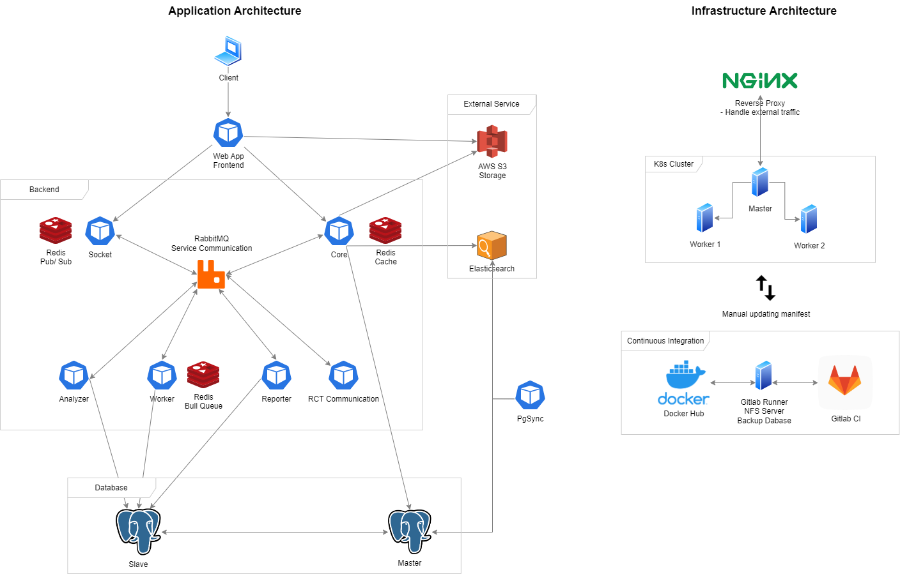

# Text Message

## 👀 Descrition
- Updating...

## 🌞 Application
### Tech Stack
- **Postgresql**: Updating...
- **Redis**: Updating...
- **RabbitMQ**: Updating...
- **AWS S3**: Updating...
- **Elastic Search**: Updating...

### Frontend Services
- **App** (frontend): Updating...
### Backend Services
- **Socket** (backend): Updating...
- **Core** (backend): Updating...
- **Analyzer** (backend): Updating...
- **Worker** (backend): Updating...
- **Reporter** (backend): Updating...
- **RCT Communication** (backend): Updating...
### How it work?
- Updating...
## 🚀 Infrastructure
### Tech Stack
- **Gitlab CI**: Updating...
- **Nginx**: Updating...
- **Kubernetes**: Updating...
### How it work
- Updating...
