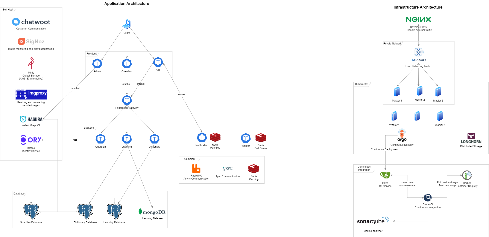

# Text Message

## 👀 Descrition
- Updating...

## 🌞 Application
### Tech Stack
- **Postgresql**: Updating...
- **MongoDB**: Updating...
- **Redis**: Updating...
- **RabbitMQ**: Updating...
- **Graphql**: Updating...
- **Minio**: Updating...
- **Image Proxy**: Updating...
- **Hasura**: Updating...
- **Ory Kratos**: Updating...
- **Signoz**: Updating...
- **Chatwoot**: Updating...
### Frontend Services
- **Admin** (frontend): Updating...
- **Guardian** (frontend): Updating...
- **App** (frontend): Updating...
### Backend Services
- **Federation Gateway** (backend): Updating...
- **Learning** (backend): Updating...
- **Guardian** (backend): Updating...
- **Dictionary** (backend): Updating...
- **Worker** (backend): Updating...
- **Notification** (backend): Updating...
### How it work?
- Updating...
## 🚀 Infrastructure
### Tech Stack
- **Uptime Kuma**: Updating...
- **Nginx**: Updating...
- **Haproxy**: Updating...
- **Kubernetes**: Updating...
- **Sonarqube**: Updating...
- **ArgoCD**: Updating...
- **Drone CI**: Updating...
- **Gitea**: Updating...
- **Harbor**: Updating...
- **Longhorn**: Updating...
### How it work
- Updating...
